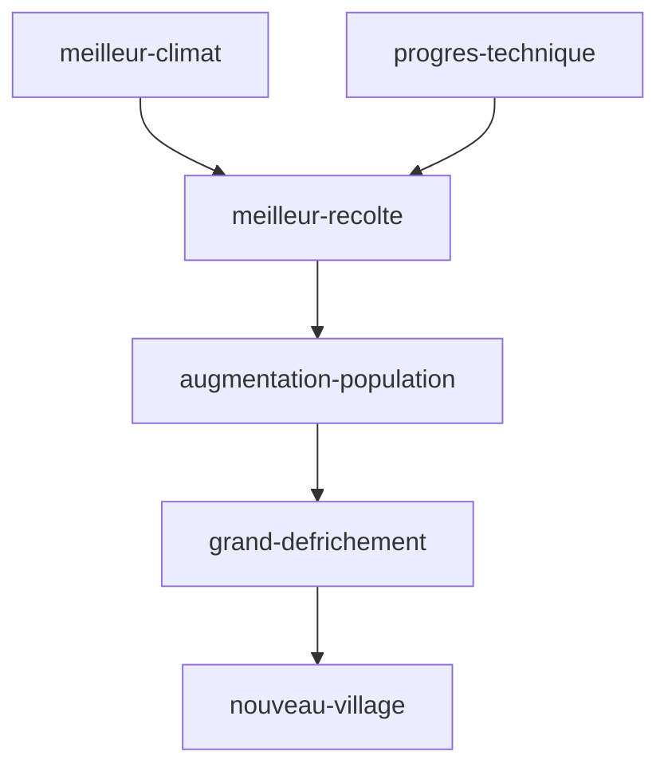

tags : #dossier


---

title:: MoyenAge
domaine:: #Histoire-Geographie 
author:: EmySushi
status:: inprogress
created:: 2023-03-08 14:34:36
updated:: 2023-03-08 14:34:36
duedate:: 2023-03-10

---


# LES PAYSANS🌽 


paysans  > travail difficile > exigeant de la terre > cultive des céréales > transformés > base de leur alimentation 
vie quotidienne se déroule au fil du soleil et des saisons.


<center>schéma::la domination des campagnes</center>



## <font color="#ff0000">vie des paysans: </font>
- vivent:
	-  dans de modestes maisons
	- moins de 40 ans 
- pas à l'abris:
	- des intempéries/famine/maladies/guerres 

## <font color="#ff0000">Evolution (XI siècle):</font>
- population augmente:
	- mieux nourris
	- progrès techniques 
- défrichement:
	- terres cultivés, villages
	- augmentent


## Le travail annuel

```timeline-labeled
[line-3, body-2]

date: Janvier 
content: il cure les fossés avec une [houe](https://fr.vikidia.org/wiki/Houe "Houe").

date: Février 
content: il épand du [fumier](https://fr.vikidia.org/wiki/Fumier "Fumier") avec une hotte et une [bêche](https://fr.vikidia.org/wiki/B%C3%AAche "Bêche").

date: Mars 
content: il taille la [vigne](https://fr.vikidia.org/wiki/Vigne "Vigne") avec une [serpe](https://fr.vikidia.org/wiki/Serpe "Serpe").

date: Avril 
content: il tond les [moutons](https://fr.vikidia.org/wiki/Mouton "Mouton") avec des « forces ».

date: Mai 
content: il continue les travaux en vue de la prochaine récolte, tandis que le seigneur chasse au [faucon](https://fr.vikidia.org/wiki/Faucon "Faucon").

date:  Juin 
content: il [récolte le blé et le foin](https://fr.vikidia.org/wiki/Fenaison "Fenaison") avec une [faux](https://fr.vikidia.org/wiki/Faux "Faux").

date: Juillet 
content: il [moissonne](https://fr.vikidia.org/wiki/Moisson "Moisson") les [céréales](https://fr.vikidia.org/wiki/C%C3%A9r%C3%A9ale "Céréale") avec une [faucille](https://fr.vikidia.org/wiki/Faucille "Faucille").

date: Août 
content: il [bat](https://fr.vikidia.org/wiki/Battage "Battage") les épis des céréales au [fléau](https://fr.vikidia.org/wiki/Fl%C3%A9au "Fléau").

date: Septembre 
content: ce sont les semailles, il [laboure](https://fr.vikidia.org/wiki/Labourage "Labourage") et [sème](https://fr.vikidia.org/wiki/Semailles "Semailles") des graines « à la volée » avec l'araire et la charrue.

date: Octobre 
content: il foule le [raisin](https://fr.vikidia.org/wiki/Raisin "Raisin") avec les pieds pour en extraire le jus qui donnera le [vin](https://fr.vikidia.org/wiki/Vin "Vin").

date: Novembre 
content: il pratique la [glandée](https://fr.vikidia.org/wiki/Gland%C3%A9e "Glandée"), grâce à un bâton lancé qui fait tomber les [glands](https://fr.vikidia.org/wiki/Gland "Gland") des [chênes](https://fr.vikidia.org/wiki/Ch%C3%AAne "Chêne") ou les [faînes](https://fr.vikidia.org/wiki/Fa%C3%AEne "Faîne") des [hêtres](https://fr.vikidia.org/wiki/H%C3%AAtre "Hêtre") qui serviront pour engraisser ses [porcs](https://fr.vikidia.org/wiki/Porc "Porc").

date: Décembre 
content: il tue le/les [cochon](https://fr.vikidia.org/wiki/Cochon "Cochon")(s).

```


![[Pasted image 20230308173724.png]]


# Les seigneurs👑


- le donjon
-  là ou le seigneur et sa famille habitent
- la salle commune
	- ou sont organisés les banquets et entremet
	- moment divertissants

organisation type d'un château
moments divertissant ? 
ceremonie d'adoubement

# Glossaire
- **Seigneur**: exerce son pouvoir sur les terres et les humains
- **Seigneurie**: domaine sur lequel le seigneur exerce son pouvoir
- **Tenure**: terres que le seigneur loue aux paysans contre taxes et corvées sur la réserve
- **Reserve**: terres que le seigneur garde pour lui même
- **Troubadour**: poète musicien itinérant de châteaux en châteaux et raconte les exploits des chevaliers
- **Adoubement**: cérémonie par laquelle on devient chevalier
- **Paysans**:  vivent du travail de la terre
- **Défrichement**:  destruction volontaire d'espaces boisés en général pour y faire de l'agriculture


**<center>LES CHATEAUX FORTS</center>
* 10-ème siècle:
* forteresse
* collines artificielles
* en terre et en bois

* 11-ème siècle:
* donjon
* appartement du seigneur
* pierre, rectangulaire

* 12-ème siècle:
* tour circulaire
* moins de matériaux
* résiste mieux aux sièges

* 13-ème siècle:
* châteaux sans donjon
* double muraille
* mieux tirer

* 14-ème siècle:
* châteaux comme des palais
* gout du luxe
* immense salle éclairées

les femmes aux châteaux

* offerte ou enlevée pour le mariage et:
 -mariée vers 15 ans 
* et ont déjà beaucoup de choses à faire:
 -broder, lire, jouer aux échecs, soigner les blessés, offrir l'hospitalité, 
 -et de veiller à l'éducation de ses enfants 
* au moment de l'accouchement:
 -c'est un moment dangereux car nombreuses à perdus la vie 
 -le nouveau né est confié à la nourrice 
 -car la durée de l'allaitement retarderait la naissance d'un autre bébé
 -la mortalité enfantine oblige à faire beaucoup de bébé

les chevaliers:

serment de fidélité:


