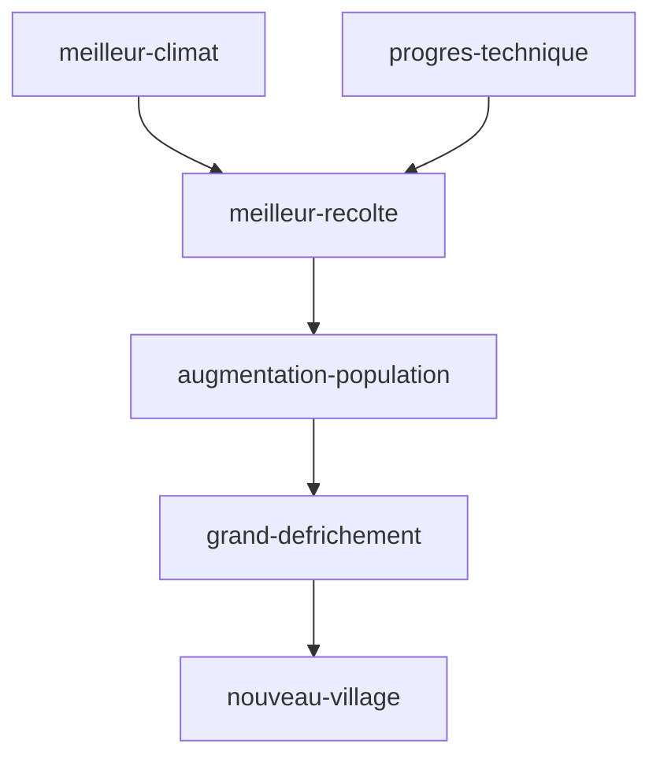

tags : #dossier


---

title:: MoyenAge
domaine:: #Histoire-Geographie 
author:: EmySushi
status:: inprogress
created:: 2023-03-08 14:34:36
updated:: 2023-03-08 14:34:36
duedate:: 2023-03-10

---

# LE MOYEN AGE
Le Moyen Âge est une période de l'histoire de l'Europe, s'étendant de la fin du V e siècle à la fin du XV e siècle, qui débute avec le déclin de  #empire_romain_occident et se termine par la #renaissance et les #grandes_decouvertes.

La civilisation médiévale se définit par quatre caractéristiques majeures : 
- le **morcellement de l'autorité politique** et le **recul de la notion d'État**
	- seigneurs fortunés (taxes, féodalité, citées riches
- une économie à **dominante agricole**
- une **société cloisonnée** entre une **noblesse militaire**, qui possède la terre, et une **classe paysanne** asservie
-  enfin, un système de pensée fondé sur la **foi religieuse** et défini par l'Église chrétienne.

# FEODALITE
Vers 1000 a jc, les châteaux forts apparaissent contrer les invasions barbares (viking, arabes) :

- affaiblissement du pouvoir royal : 
	- frontières peu définies, 
	- conflits entre les comtés,
	- le pouvoir appartient aux guerriers les mieux armés (impose leurs lois). Les chateaux rappellent aux habitants qui est le maitre
- augmentation de l'insécurité
	- invasions barbares
	- conflits entre les contés

La feodalité diffère selon les regions (dans le sud de la France, nombreux chevaliers possèdent leur propre terre)


## Les devoirs de chacun
```col-md

- !!!col
	- 1
		# SEIGNEUR
		- donne au vassal les moyens de se nourrir (fiefs)
		- donne au vassal les moyens de s'équipper militairement (fiefs)
		- protège le vassal
	- 2
		# VASSAL
		- promet fidélité au seigneur (cérémonie de l'hommage)
		- les fieifs se transmettent de pere en fils
		- service de chevauchée (faire la guerre - limité a 40jrs / an)

```


# EVOLUTION DES CHATEAUX FORTS 
* **10-ème siècle:**
	* forteresse
	* collines artificielles
	* en terre et en bois

* **11-ème siècle:**
	* donjon
	* appartement du seigneur
	* pierre, rectangulaire

* **12-ème siècle:**
	* tour circulaire
	* moins de matériaux
	* résiste mieux aux sièges

* **13-ème siècle:**
	* châteaux sans donjon
	* double muraille
	* mieux tirer

* **14-ème siècle:**
	* châteaux comme des palais
	* gout du luxe
	* immense salle éclairées


# DEVENIR CHEVALIER


- **Leçon du maitre d'arme**
	- maniement de l'épée, lance
	- combat à cheval
	- 10 ans
- **Adoubement**
	- adouber = équiper
	- par le prêtre
	- reçoit leur épée, leur armure
	- reçoit un cheval pour certain (destrier)
- **Après adoubement**
	- doit attirer l'attention d'un puissant seigneur (donner un fief ? ou une épouse)
	- s'entourer de valeureux guerrier

## ARMES ET ARMURES

- Lance
- la lame (épée)
- arbalète
- broigne (tunique de cuir)
- tricot de métal (15kg, 100 heures de travail)
- harnois blanc (armure plate)
- bouclier en forme d'amende (écu)

## Chevalier et légende
La chevalerie se donne une belle image d'elle même au travers
- les comtes 

Roland le brave: plus connus et plus anciens chevalier de la littérature occidentale (neveu de Charlemagne)
Le parfait chevalier: Lancelot tombe amoureux de Guenièvre (épouse de Arthur) mais c'est fait enlever et pars la retrouver
La quête du Graal: autour de la table ronde, les chevaliers du roi Arthur veulent le Graal (coupe sacré ayant contenu le sang du christ)
Le bien contre le mal: Saint Georges et Saint Michel sont les saints patrons, représentés en train de combattre le dragon (diable)
Un amour impossible: le roi Marc veut épouser Yseut et Tristan la ramène mais par erreur boivent un filtre d'amour

# LA VIE AU CHATEAU

## La vie de cour
la chasse, les jeux, et d'autres divertissements:

jongleurs: font régner dans le château une ambiance de fête, à la fois bouffon, acteurs et acrobates ils savent aussi chanter des poèmes
troubadour: composent leur propre musique, récités et chantés, retraçant les actions héroïques des chevaliers
dans les récits d'amour courtois le chevalier se bat pour l'amour d'une dame

## Les femmes au château

* offerte ou enlevée pour le mariage et:
 -mariée vers 15 ans - non pour une affaire de cœur
* et ont déjà beaucoup de choses à faire:
 -broder, lire, jouer aux échecs, soigner les blessés, offrir l'hospitalité, 
 -et de veiller à l'éducation de ses enfants 
* au moment de l'accouchement:
 -c'est un moment dangereux car nombreuses à perdus la vie 
 -le nouveau né est confié à la nourrice 
 -car la durée de l'allaitement retarderait la naissance d'un autre bébé
 -la mortalité enfantine oblige à faire beaucoup de bébé 

## La table des seigneurs
les occasions de festoyer sont nombreuses, nourris copieusement, en montrant sa belle vaisselle et ses habits luxueux
comme les convives manges avec leur 3 doigts chacun se lave les mains avant de passer à table

table: planche soutenue par des tréteaux et couverte d'une nappe
assiettes: tranchoirs, plaques de métal ou de bois recouvertes de larges tranches de pain
couverts: fourche à deux dents et d'un couteaux, gobelets en métal ou coupes en bois
et les salières (la plus grosse près du maitre de maison)

aliments: le gibier, bœuf, veau, agneau que l'on sert en bouillit, rôti ou farci, porcelets de lait ou sangliers de la foret
les mets: oiseaux (car ils volent près du ciel donc près de Dieux)
boissons: hypocras (vin au miel et aux épices)
desserts: fruits et fruits secs, plus gourmands grignotes des gaufres, crêpes, amandes et noisettes macérées dans du miel

## La musique
le tambourin et la flute: pour rythmer les pas des danseur lors des fêtes au villages ou celui de l'ours
ancêtre du violon: muni de cordes pincées sur le manche pour produire des notes graves
la luth: cordes pincées avec un plectre (petite pièce en écaille ou en bois)
le psaltérion: gratte les cordes avec des plumes d'oie et produit un son mélodieux (s'accorde avec le luth)

# AGRICULTURE
## Le travail de la terre
 augmenter les surfaces cultivées:
11-ème siècle: seigneurs poussent les paysans à défricher les forets
l'importance du labour:
grâce à la charrue à roue tirée par des bœufs l'on peut plus facilement retourner la terre
le cycle des cultures:
pour tenter d'augmenter les récoltes ils laissent 1/3 du sol au repos dans l'autre ils sèment le blé pour le dernier reçoit de l'avoine…
les vendanges: 
la récolte du raisin exige beaucoup de main d'œuvres, les grappes coupées 1par1 sont transportées puis foulées avant d'être pressé

## Se nourrir
partout en Europe, les fêtes paysannes célèbrent la terre nourricière:
après les famines, les défrichements et l'accroissement des cultures permet à l'Europe de manger à peu près à sa faim,
mais la population augmente plus vite que les rendements agricoles ,
mais vers 1300 un climat froid et pluvieux fait pourrir les récoltes et aggrave la situation, les famines réapparaisses
# LES VILLES MEDIEVALES


## Habitats et matériaux
de la pierre près des carrières, du bois et de l'argile ailleurs, la brique mais elle coute cher (à cause de sa cuisson à haute température)
## Les villes
enserrant d'abord le château la muraille s'est agrandie au fil des siècles 
les rues sont encombrées d'étalages, le cri des marchands ambulants
les villes françaises choquent les étrangers de leur saleté mais pourtant le règlement dit a chacun de balayer devant sa porte
## Le pouvoir des villes
les riches bourgeois et les grandes familles européennes dominent les villes à partir du 12-ème siècle
les fils des seigneurs émigrent vers les villes pour y tenter de fructueuses affaires
la majorité de la population est constituée d'ouvrier textile, marchand ambulant, petit boutiquier et payent peux d'impôts
en revanche ils sont privés de tout droit les étrangers et les vagabonds qui vivent de rapines et de la charité des autres
## Les métiers
les rues étaient toutes pleines d'ouvriers qui pratiquaient: le fer, le textile, le tondage…
les 1er métiers crées sont ceux de l'alimentation
au 11eme les boulangers et les bouchers
les métiers regroupent 3 catégories d'individus: les maitres, les valets et les apprentis 
## La gestion du savoir
au 12eme l'école de Paris est spécialisée à l'études des religions et attire de nombreux élèves étrangers et à de maitres 
les universités s'ouvrent à mesure qu'avance la reconquête chrétienne
tout commence par un séjour de 6 ans à la faculté des arts, puis les étudiants peuvent se spécialiser
l'enseignement et en principe gratuit
## Fêtes et foires
les jours de foire au marché, la ville connait d'autres divertissement grâce aux musicien, jongleurs, acteurs
mimant les aventures des chevaliers ou celles de la vie des saints en se déguisant et en dansant
au Moyen Age  l'église considère le métier de marchand impur ou malhonnête
plusieurs fois par an les marchands européens prennent l'habitude de se rencontrer aux foires internationales pour traiter leur affaires
## Commerces (mers/ports)
la mer est mieux adaptée au transport des marchandises lourdes sur de longues distances mais dangereuse
les marchandises de toutes sortes sont acheminées à travers la Méditerrané des produits de luxe comme:
tapis, soies, parfums, sucre, coton, ivoire et surtout des épices:
poivre, cannelle, clous de girofle,.


# LES PAYSANS🌽 


paysans  > travail difficile > exigeant de la terre > cultive des céréales > transformés > base de leur alimentation 
vie quotidienne se déroule au fil du soleil et des saisons.


<center>schéma::la domination des campagnes</center>



## <font color="#ff0000">vie des paysans: </font>
- vivent:
	-  dans de modestes maisons
	- moins de 40 ans 
- pas à l'abris:
	- des intempéries/famine/maladies/guerres 

## <font color="#ff0000">Evolution (XI siècle):</font>
- population augmente:
	- mieux nourris
	- progrès techniques 
- défrichement:
	- terres cultivés, villages
	- augmentent


## Le travail annuel

```timeline-labeled
[line-3, body-2]

date: Janvier 
content: il cure les fossés avec une [houe](https://fr.vikidia.org/wiki/Houe "Houe").

date: Février 
content: il épand du [fumier](https://fr.vikidia.org/wiki/Fumier "Fumier") avec une hotte et une [bêche](https://fr.vikidia.org/wiki/B%C3%AAche "Bêche").

date: Mars 
content: il taille la [vigne](https://fr.vikidia.org/wiki/Vigne "Vigne") avec une [serpe](https://fr.vikidia.org/wiki/Serpe "Serpe").

date: Avril 
content: il tond les [moutons](https://fr.vikidia.org/wiki/Mouton "Mouton") avec des « forces ».

date: Mai 
content: il continue les travaux en vue de la prochaine récolte, tandis que le seigneur chasse au [faucon](https://fr.vikidia.org/wiki/Faucon "Faucon").

date:  Juin 
content: il [récolte le blé et le foin](https://fr.vikidia.org/wiki/Fenaison "Fenaison") avec une [faux](https://fr.vikidia.org/wiki/Faux "Faux").

date: Juillet 
content: il [moissonne](https://fr.vikidia.org/wiki/Moisson "Moisson") les [céréales](https://fr.vikidia.org/wiki/C%C3%A9r%C3%A9ale "Céréale") avec une [faucille](https://fr.vikidia.org/wiki/Faucille "Faucille").

date: Août 
content: il [bat](https://fr.vikidia.org/wiki/Battage "Battage") les épis des céréales au [fléau](https://fr.vikidia.org/wiki/Fl%C3%A9au "Fléau").

date: Septembre 
content: ce sont les semailles, il [laboure](https://fr.vikidia.org/wiki/Labourage "Labourage") et [sème](https://fr.vikidia.org/wiki/Semailles "Semailles") des graines « à la volée » avec l'araire et la charrue.

date: Octobre 
content: il foule le [raisin](https://fr.vikidia.org/wiki/Raisin "Raisin") avec les pieds pour en extraire le jus qui donnera le [vin](https://fr.vikidia.org/wiki/Vin "Vin").

date: Novembre 
content: il pratique la [glandée](https://fr.vikidia.org/wiki/Gland%C3%A9e "Glandée"), grâce à un bâton lancé qui fait tomber les [glands](https://fr.vikidia.org/wiki/Gland "Gland") des [chênes](https://fr.vikidia.org/wiki/Ch%C3%AAne "Chêne") ou les [faînes](https://fr.vikidia.org/wiki/Fa%C3%AEne "Faîne") des [hêtres](https://fr.vikidia.org/wiki/H%C3%AAtre "Hêtre") qui serviront pour engraisser ses [porcs](https://fr.vikidia.org/wiki/Porc "Porc").

date: Décembre 
content: il tue le/les [cochon](https://fr.vikidia.org/wiki/Cochon "Cochon")(s).

```


![[Pasted image 20230308173724.png]]


# LES SEIGNEURS👑


- le donjon
-  là ou le seigneur et sa famille habitent
- la salle commune
	- ou sont organisés les banquets et entremet
	- moment divertissants

organisation type d'un château
moments divertissant ? 
ceremonie d'adoubement

# Glossaire
- **Seigneur**: exerce son pouvoir sur les terres et les humains
- **Seigneurie**: domaine sur lequel le seigneur exerce son pouvoir
- **Tenure**: terres que le seigneur loue aux paysans contre taxes et corvées sur la réserve
- **Reserve**: terres que le seigneur garde pour lui même
- **Troubadour**: poète musicien itinérant de châteaux en châteaux et raconte les exploits des chevaliers
- **Adoubement**: cérémonie par laquelle on devient chevalier
- **Paysans**: vivent du travail de la terre
- **Défrichement**: destruction volontaire d'espaces boisés en général pour y faire de l'agriculture
- Fief: terre ou somme d'argent qu'un seigneur cède a un guerrier moins puissant pour qu'il devienne son vassal
- Vassal: homme lié personnellement à un seigneur, un suzerain qui lui concédait la possession effectif d'un fief
- Suzerain: seigneur qui avait concédé un fief à un vassal


