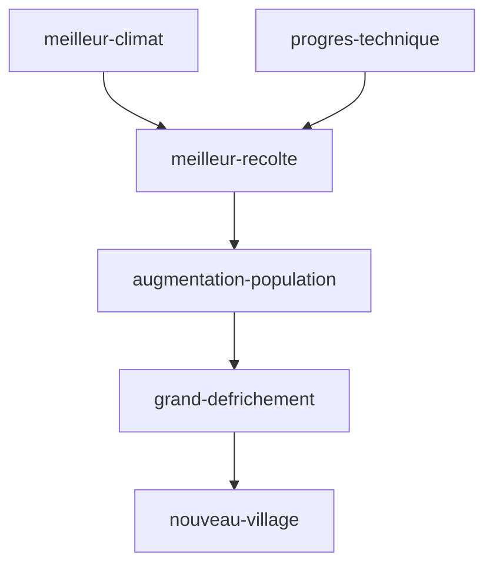

tags : #dossier

---

title:: MoyenAge
domaine:: #Histoire-Geographie 
author:: EmySushi
status:: unread
created:: 2023-03-08 14:34:36
updated:: 2023-03-08 14:34:36

---
# LES PAYSANS🌽 

- Paysans:  vivent du travail de la terre- 
- Défrichement:  destruction volontaire d'espaces boisés en général pour y faire de l'agriculture

paysans  > travail difficile > exigeant de la terre > cultive des céréales > transformés > base de leur alimentation 
vie quotidienne se déroule au fil du soleil et des saisons.

schéma::la domination des campagnes

## vie des paysans: 
- vivent:
	-  dans de modestes maisons
	- moins de 40 ans 
- pas à l'abris:
	- des intempéries/famine/maladies/guerres 

XI:
- population augmente:
	- mieux nourris
	- progrès techniques 
- défrichement:
	- terres cultivés, villages
	- augmentent
 

# les seigneurs👑

Seigneur: exerce son pouvoir sur les terres et les humains
Seigneurie: domaine sur lequel le seigneur exerce son pouvoir 
Tenure: terres que le seigneur loue aux paysans contre taxes et corvées sur la réserve
Reserve: terres que le seigneur garde pour lui même

- le donjon 
	- là ou le seigneur et sa famille habitent
- la salle commune
	- ou sont organisés les banquets et entremet
	- moment divertissants

Troubadour: poète musicien itinérant de châteaux en châteaux et raconte les exploits des chevaliers
Adoubement: cérémonie par laquelle on devient chevalier
