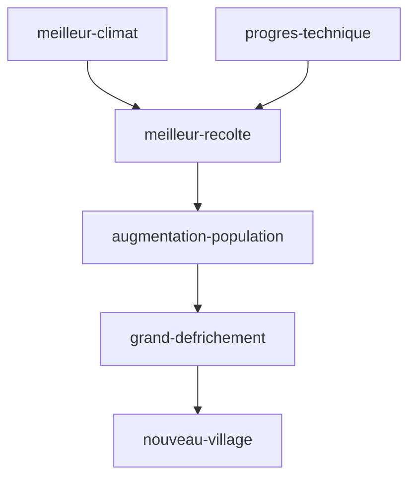

tags : #dossier

---

title:: MoyenAge
domaine:: #Histoire-Geographie 
author:: EmySushi
status:: unread
created:: 2023-03-08 14:34:36
updated:: 2023-03-08 14:34:36

---
LES PAYSANS 

Paysans:  vivent du travail de la terre 
Défrichement:  destruction volontaire d'espaces boisés en général pour y faire de l'agriculture

paysans  > travail difficile > exigeant de la terre > cultive des céréales > transformés > base de leur alimentation 
vie quotidienne se déroule au fil du soleil et des saisons.

schéma::la domination des campagnes

