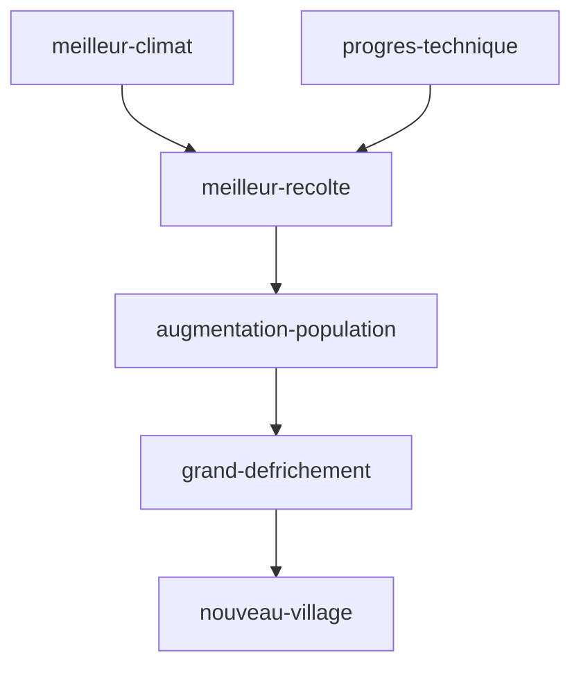

tags : #dossier


---

title:: MoyenAge
domaine:: #Histoire-Geographie 
author:: EmySushi
status:: done
created:: 2023-03-08 14:34:36
updated:: 2023-03-08 14:34:36
duedate:: 2023-03-10

---


# LE MOYEN AGE
---

Le Moyen Âge est une période de l'histoire de l'Europe, s'étendant de la fin du V e siècle à la fin du XV e siècle, qui débute avec le déclin de  #empire_romain_occident et se termine par la #renaissance et les #grandes_decouvertes.

La civilisation médiévale se définit par quatre caractéristiques majeures : 
- le **morcellement de l'autorité politique** et le **recul de la notion d'État**
	- seigneurs fortunés (taxes, féodalité, citées riches
- une économie à **dominante agricole**
- une **société cloisonnée** entre une **noblesse militaire**, qui possède la terre, et une **classe paysanne** asservie
-  enfin, un système de pensée fondé sur la **foi religieuse** et défini par l'Église chrétienne.

# FEODALITE
---
Vers 1000 av                                                                                                                                                                                                                               
JC, les châteaux forts apparaissent contrer les invasions barbares (viking, arabes) :

- **affaiblissement du pouvoir royal**
	- frontières peu définies, 
	- conflits entre les comtés,
	- le pouvoir appartient aux guerriers les mieux armés (impose leurs lois). Les châteaux rappellent aux habitants qui est le maitre
- **augmentation de l'insécurité**
	- invasions barbares
	- conflits entre les contés

La féodalité diffère selon les régions (dans le sud de la France, nombreux chevaliers possèdent leur propre terre)


## Les devoirs de chacun
```col-md

- !!!col
	- 1
		# SEIGNEUR
		- donne au vassal les moyens de se nourrir (fiefs)
		- donne au vassal les moyens de s'équipper militairement (fiefs)
		- protège le vassal
	- 2
		# VASSAL
		- promet fidélité au seigneur (cérémonie de l'hommage)
		- les fiefs se transmettent de pere en fils
		- service de chevauchée (faire la guerre - limité a 40jrs / an)

```


# EVOLUTION DES CHATEAUX FORTS 
---

* **10-ème siècle:**
	* forteresse
	* collines artificielles
	* en terre et en bois

* **11-ème siècle:**
	* donjon
	* appartement du seigneur
	* pierre, rectangulaire

* **12-ème siècle:**
	* tour circulaire
	* moins de matériaux
	* résiste mieux aux sièges

* **13-ème siècle:**
	* châteaux sans donjon
	* double muraille
	* mieux tirer

* **14-ème siècle:**
	* châteaux comme des palais
	* gout du luxe
	* immense salle éclairées


# DEVENIR CHEVALIER
---

- **Leçon du maitre d'arme**
	- maniement de l'épée, lance
	- combat à cheval
	- 10 ans
- **Adoubement**
	- adouber = équiper
	- par le prêtre
	- reçoit leur épée, leur armure
	- reçoit un cheval pour certain (destrier)
- **Après adoubement**
	- doit attirer l'attention d'un puissant seigneur (donner un fief ? ou une épouse)
	- s'entourer de valeureux guerrier

## ARMES ET ARMURES

- Lance
- la lame (épée)
- arbalète
- broigne (tunique de cuir)
- tricot de métal (15kg, 100 heures de travail)
- harnois blanc (armure plate)
- bouclier en forme d'amende (écu)

## Chevalier et légende
-  Représentation Chevalerie :
	- ordre immuable (codes, cérémonies ...) vs chaos  (guerres, maladies)
	- valeurs (honneur, causes défendues )
	- perpétue cette image via les comtes, chants (troubadour)
- les comtes :
	- Roland le brave: plus connus et plus anciens chevalier de la littérature occidentale (neveu de Charlemagne)
	- Le parfait chevalier: Lancelot tombe amoureux de Guenièvre (épouse de Arthur) mais c'est fait enlever et pars la retrouver
	- La quête du Graal (chevalier de la table ronde / Roi Arthur / Merlin): autour de la table ronde, les chevaliers du roi Arthur veulent le Graal (coupe sacrée ayant contenu le sang du christ)
	- Le bien contre le mal: Saint Georges et Saint Michel sont les saints patrons, représentés en train de combattre le dragon (diable)
	- Un amour impossible: le roi Marc veut épouser  Tristan & Yseult et la ramène mais par erreur boivent un filtre d'amour


# LA VIE AU CHATEAU
---

## La vie de cour
- La cour = espace dans le château ou habite le seigneur + ensemble des personnes qui l'entourent 
- durant les mois d'hiver (sans guerre) = nécessité d'occuper les chevaliers
	- **chasse**
	- **jongleurs:**  ambiance de fête (bouffon, acteurs et acrobates, chanteurs de poèmes)
	- **troubadour:** compositeur, transmission des comtes et légendes (chevalerie, histoire) 


## Les femmes au château

* les femmes + mariages = alliances entre familles
	* offerte ou enlevée pour le mariage (forcée ~15 ans,  par amour)
* Taches
	* broderie, lecture, jeux, soins des blessé
	* gestion de la vie du château
	* éducation des enfants (confiés à une nourrice)
* Accouchement
	* dangereux ( technique médicale absente, maladie) => mortalité infantile oblige à faire beaucoup de bébé 
	 - nouveau né est confié à la nourrice (allaitement) =>  la durée de l'allaitement retarderait la naissance d'un autre bébé

## La table des seigneurs
- fastes :
	- indication de la richesse, le rang
	- nourriture abondantes et soignées, belles vaisselles, habits luxueux
- les convives manges avec leurs 3 doigts, lavage des mains avant de passer à table
- table:  tréteaux + nappe, assiettes, tranchoirs (pain)
- couverts: fourche à deux dents,  couteaux, gobelets en métal/ coupes en bois
- les salières (la plus grosse près du maitre de maison)
- aliments/boissons:
	- gibier (sanglier …), bœuf, veau, agneau()bouillit, rôti, farci) , porcelets de lait, oiseaux (pigeonnier) 
	- boissons: hypocras (vin au miel et aux épices)
	- desserts: fruits, fruits secs, gaufres, crêpes, amandes et noisettes macérées dans du miel

## La musique
- tambourin / flute: rythme les pas des danseur lors des fêtes au villages
- instrument a corde (pincées) :
	- rebec(ancêtre du violon): notes graves
	- luth:  plectre (petite pièce en écaille ou en bois)
	- psaltérion: gratte les cordes avec des plumes d'oie et produit un son mélodieux (s'accorde avec le luth)


# AGRICULTURE
---
## Le travail de la terre
- objectif :** augmenter les surfaces cultivées**
	- 11-ème siècle: seigneurs poussent les paysans à** défricher les forets**
	- l'importance du **labour** (charrue tirée par des bœufs): retourner facilement la terre
	- les villages sont crées dans les clairières protégés par des haies
- Agriculture
	- **Cycle des cultures (tous les 3 ans):**
		- 1/3 : sol au repos ( #jachere)
		- 1/3 : semis blés (octobre), 
		- 1/3 : semis avoine/orge (printemps) : récolte + rapide
	- moisson (faux, faucille, fléau) : la paille nourrie le bétail
	- récolte stockée dans les greniers => très mauvaises conditions (perte due à l'humidité)
- Vendanges: 
	- exige beaucoup de main d'œuvres,
	- grappes coupées 1 par 1 > transportées > foulées > pressées
	- le vin se conserve mal (vendu dans l 'année')
- Bétail
	- pait dans les jachères et montagne ( #transhumance en été)
	- le foin est insuffisant pour nourrir le bétail en hiver => abattage en automne
- Forêts
	- garder pour le seigneur (chasse)
	- réservoir de nourriture pour les paysans (lapins, perdrix, glands, noisettes, champignons
	- charbons

## Se nourrir
- partout en Europe, les fêtes paysannes célèbrent la terre nourricière:
- Famines 
	- debut 11 ième cycle
	- les défrichements + l'accroissement des cultures permet à l'Europe de manger à peu près à sa faim
- population augmente plus vite que les 
- vers 1300 un climat froid et pluvieux fait pourrir les récoltes et aggrave la situation, les famines réapparaisses


# LES VILLES MEDIEVALES
---


## Habitats et matériaux
- pierre près des carrières
-  bois et de l'argile ailleurs,
- brique (cout important =>cuisson à haute température)
## Les villes
- enserrant d'abord le château (évolution au fil des siècles. Cf château fort) 
- rues encombrées d'étalages, marchands ambulants
- villes françaises : saleté malgré règlement existant 
## Le pouvoir des villes
- riches bourgeois et grandes familles européennes dominent les villes à partir du 12-ème siècle
- fils des seigneurs émigrent vers les villes pour y tenter de fructueuses affaires
- la majorité de la population : ouvrier textile, marchand ambulant, petit boutiquier
	- payent peux d'impôts
	- privés de tout droit
- étrangers et vagabonds : vivent de rapines et charité
## Les métiers
- les métiers regroupent 3 catégories d'individus: 
	- maitres : 
		- propriétaire boutique
		- distinction reçue après avoir réalisé un chef d'œuvre de maitrise (fils de maitre)
	- valets : professionnels 
	- apprentis : 
		- durée de 4 à 12 ans
		- nourris, logés, blancis
		- soumis au pouvoir des maîtres
- les rues fourmillent d'ouvriers : le fer, le textile, le tondage…
- alimentation :
	- les 1er métiers crées 
	- au 11eme les boulangers et les bouchers
- Textiles
	- spécialisations poussées
		- travail de la laine (nettoyage, peignage, tissage, teinture, tonte, repassage, pliage, transport)
- Atelier
	- situés au rez de chaussé
	- habitation à l'étage
	- echoppes ouvertent sur la rue
	- les ouvriers travaillent devant le client (reglement de fabrication = evite la malfacon)
	- travail sur mesure (tailleur, gantier, cordonnier)
- tensions sociales existantes
	- grèves

> [!tip]
> le peuple de Paris vient chercher de l'embauche place de Grève. L'expression être en grève puis faire la grève vient de ce lieux


## La gestion du savoir
- depuis haut du moyen Age  des écoles sont chargés de la formation des religieux.
- les écoles se spécialisent par la suite : au 12eme l'école de Paris est spécialisée à l'études des religions et attire de nombreux élèves étrangers et à de maitres 
- organisation des études
	- 6 années à la facultés des arts (les 7 arts libéraux : grammaire, littérature, philosophie, géométrie, arithmétique, astronomie, musique)
	- spécialisation par la suite
- enseignement gratuit même si les maitre demande de l'argent / cadeaux
- les universités s'ouvrent à mesure qu'avance la reconquête chrétienne

## Fêtes et foires
- spectacles de plein air
	- musicien, jongleurs, acteurs (la chevalerie, saints) en se déguisant et en dansant
- au Moyen Age  l'église considère le métier de marchand impure ou malhonnête
- Echanges internationaux : plusieurs fois par an les marchands européens prennent l'habitude de se rencontrer aux foires internationales pour traiter leur affaires
- échanges monétaires
	- Ecu, florin, ducats (monnaie italienne : le dollar du moyen age)
	- matériaux : or, argent
	- frappés par les seigneurs
	- présence de changeur qui pèsent pour vérifier leur poids
- augmentation de la vente à crédit (banquier). Prêt contre intérêt
## Commerces (mers/ports)
- transport maritime 
	- mieux adapté pour de lourde charge
	- longues distances
	- plus dangereux : intempéries, piraterie. Escorte de protection
- Innovations techniques  : étambot (gouvernail), boussole, astrolabe, cartes marines
- marchandises de luxe :
	- tapis, cotin, ivoire, soieries, parfum, bois précieux, épices (poivre, cannelle, clous de girofle)
	- orient (italiens) + Méditerrané
- Présences de marchands partout  :port, comptoirs, grandes villes (quartiers reservés)
- techniques de commerces (credit, comptabilité, assurance)
- principaux ports : bruges (belgique), la rochelle (france), lisbonne (portugal), venise et gènes et naples (italie), constantinople (turquie), damas (syrie), le caire (egypte)


# LES PAYSANS🌽 
---


paysans  > travail difficile > exigeant de la terre > cultive des céréales > transformés > base de leur alimentation 
vie quotidienne se déroule au fil du soleil et des saisons.


<center>schéma::la domination des campagnes</center>



## <font color="#ff0000">vie des paysans: </font>
- vivent:
	-  dans de modestes maisons
	- moins de 40 ans 
- pas à l'abris:
	- des intempéries/famine/maladies/guerres 

## <font color="#ff0000">Evolution (XI siècle):</font>
- population augmente:
	- mieux nourris
	- progrès techniques 
- défrichement:
	- terres cultivés, villages
	- augmentent


## Le travail annuel

```timeline-labeled
[line-3, body-2]

date: Janvier 
content: il cure les fossés avec une [houe](https://fr.vikidia.org/wiki/Houe "Houe").

date: Février 
content: il épand du [fumier](https://fr.vikidia.org/wiki/Fumier "Fumier") avec une hotte et une [bêche](https://fr.vikidia.org/wiki/B%C3%AAche "Bêche").

date: Mars 
content: il taille la [vigne](https://fr.vikidia.org/wiki/Vigne "Vigne") avec une [serpe](https://fr.vikidia.org/wiki/Serpe "Serpe").

date: Avril 
content: il tond les [moutons](https://fr.vikidia.org/wiki/Mouton "Mouton") avec des « forces ».

date: Mai 
content: il continue les travaux en vue de la prochaine récolte, tandis que le seigneur chasse au [faucon](https://fr.vikidia.org/wiki/Faucon "Faucon").

date:  Juin 
content: il [récolte le blé et le foin](https://fr.vikidia.org/wiki/Fenaison "Fenaison") avec une [faux](https://fr.vikidia.org/wiki/Faux "Faux").

date: Juillet 
content: il [moissonne](https://fr.vikidia.org/wiki/Moisson "Moisson") les [céréales](https://fr.vikidia.org/wiki/C%C3%A9r%C3%A9ale "Céréale") avec une [faucille](https://fr.vikidia.org/wiki/Faucille "Faucille").

date: Août 
content: il [bat](https://fr.vikidia.org/wiki/Battage "Battage") les épis des céréales au [fléau](https://fr.vikidia.org/wiki/Fl%C3%A9au "Fléau").

date: Septembre 
content: ce sont les semailles, il [laboure](https://fr.vikidia.org/wiki/Labourage "Labourage") et [sème](https://fr.vikidia.org/wiki/Semailles "Semailles") des graines « à la volée » avec l'araire et la charrue.

date: Octobre 
content: il foule le [raisin](https://fr.vikidia.org/wiki/Raisin "Raisin") avec les pieds pour en extraire le jus qui donnera le [vin](https://fr.vikidia.org/wiki/Vin "Vin").

date: Novembre 
content: il pratique la [glandée](https://fr.vikidia.org/wiki/Gland%C3%A9e "Glandée"), grâce à un bâton lancé qui fait tomber les [glands](https://fr.vikidia.org/wiki/Gland "Gland") des [chênes](https://fr.vikidia.org/wiki/Ch%C3%AAne "Chêne") ou les [faînes](https://fr.vikidia.org/wiki/Fa%C3%AEne "Faîne") des [hêtres](https://fr.vikidia.org/wiki/H%C3%AAtre "Hêtre") qui serviront pour engraisser ses [porcs](https://fr.vikidia.org/wiki/Porc "Porc").

date: Décembre 
content: il tue le/les [cochon](https://fr.vikidia.org/wiki/Cochon "Cochon")(s).

```


![[Pasted image 20230308173724.png]]


# LES SEIGNEURS👑
---


- le #donjon 
-  là ou le seigneur et sa famille habitent
- la salle commune
	- ou sont organisés les banquets et entremet
	- moment divertissants

organisation type d'un château
moments divertissant ? 
ceremonie d'adoubement

## Les impots :

- #cens 
-  #corvée 
- #champart 
- #taille


 # GLOSSAIRE
---
- #adoubement: cérémonie par laquelle on devient chevalier
- #avoine : 
- #amour-courtois : 
- #banalités : 
- #blés : 
- #chaume : 
- #cens : 
- #créneaux : 
- #champart : 
- #chasse-a-courre : 
- #corvée : 
- #chemin-de-ronde : 
- #donjon : 
- #douve : 
- #écu : 
- #eculelle : 
- #écuyer : 
- #entremet : 
- #étrier : 
- #gibets : 
- #haubert ( #cotte-de-maille ) : 
- #heaume : 
- 
- #meurtrières :
- #machicoulis : 
- #orge : 
- #pont-levis : 
-  #reserves: terres que le seigneur garde pour lui même
- #ramparts :
- #seigle : 
- #Seigneur: exerce son pouvoir sur les terres et les humains
- #seigneurie: domaine sur lequel le seigneur exerce son pouvoir
- #taille : impôt protection paysan
- #torchis : 
- #tournoi : 
- #tenure: terres que le seigneur loue aux paysans contre taxes et corvées sur la réserve
- #troubadour: poète musicien itinérant de châteaux en châteaux et raconte les exploits des chevaliers
- #paysans: vivent du travail de la terre
- #défrichement: destruction volontaire d'espaces boisés en général pour y faire de l'agriculture
- #fief: terre ou somme d'argent qu'un seigneur cède a un guerrier moins puissant pour qu'il devienne son vassal
- #vassal: homme lié personnellement à un seigneur, un suzerain qui lui concédait la possession effectif d'un fief
- #suzerain: seigneur qui avait concédé un fief à un vassal
- #serpette :
- #transhumance

- #fenaison : 
- **faux : cf plus haut
- **faucille : cf plus haut
- **moisson : **
- **battage : **
- **semailles :**
- **foulages :**
- **torchis :**
- **chaume : 
- **collier d'épaule : **
- **charrue à roue : **
- **soc en fer :**
- #jachere:
-  


