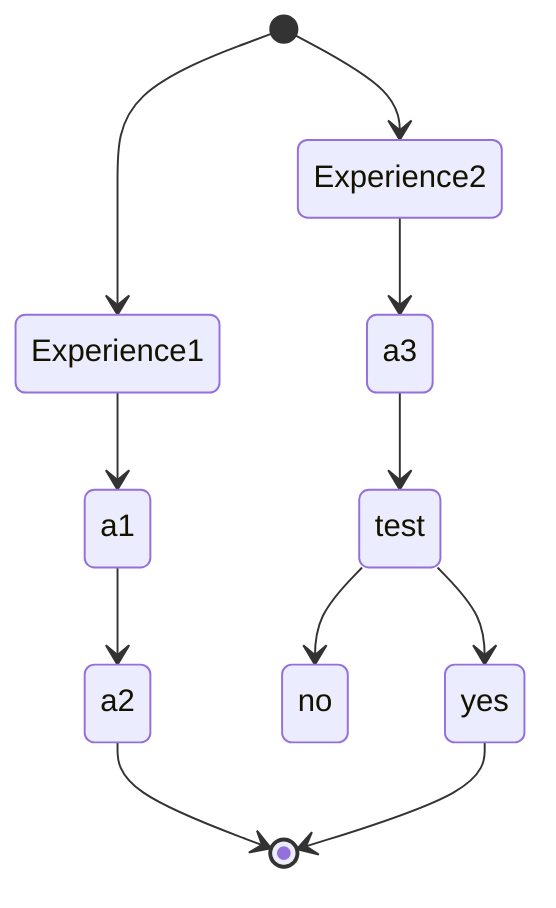
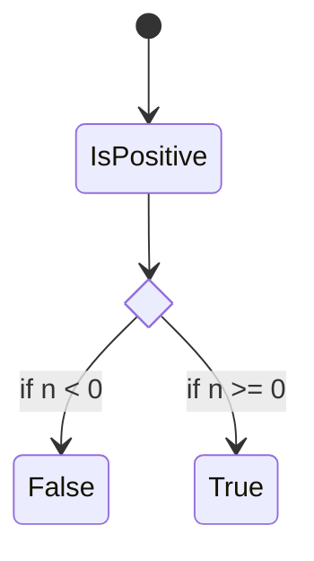

tags : #fiche  #Physique-Chimie #corps_pure_melange

---

title:: corps_pure_melange
domaine:: #Physique-Chimie
author:: EmySushi
status:: inprogress
created:: 2023-03-13 16:04:11
updated:: 2023-03-13 16:04:11

---
 mélanges        et constituants 

## Définitions
---

## Idées a retenir
---

---

## Liens

Note :  Noter les liens interessant se rapportant au sujet

- liens1
- liens2

## Outils utiles

-   [Resoomer](https://resoomer.com/fr) : en ligne + extension navigateur, multilingue
-   [SMMRY](https://smmry.com/) : en ligne, anglais
-   [Text Summarizer](http://textsummarization.net/text-summarizer) : en ligne, anglais
-   [Text Compactor](https://www.textcompactor.com/) : en ligne, anglaisstateDiagram-v2
        state if_state <<choice>>
        [*] --> IsPositive
        IsPositive --> if_state
        if_state --> False: if n < 0
        if_state --> True : if n >= 0
stateDiagram-v2
        state if_state <<choice>>
        [*] --> IsPositive
        IsPositive --> if_state
        if_state --> False: if n < 0
        if_state --> True : if n >= 0
