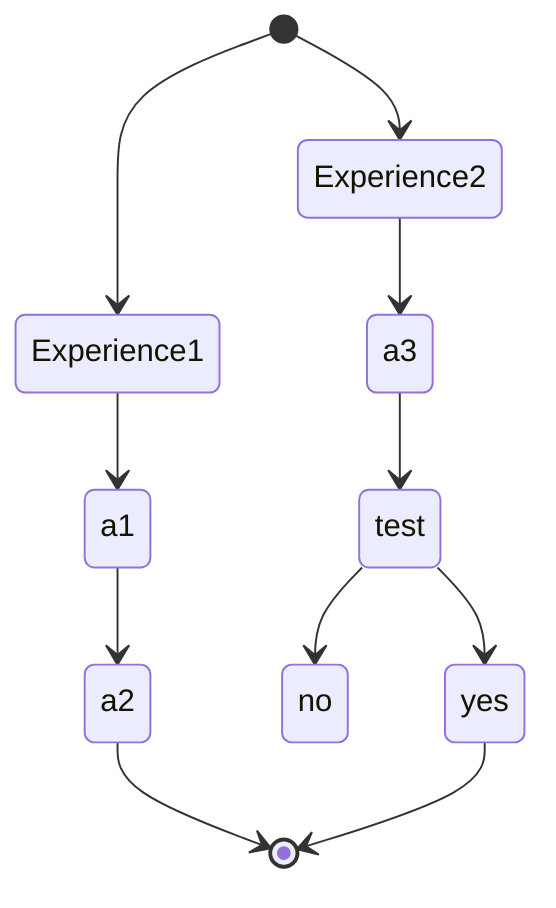
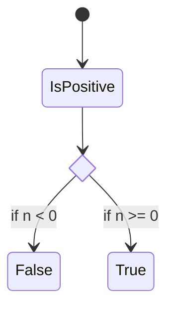

tags : #fiche  #Technologie #materiaux_evolution

---

title:: materiaux_evolution
domaine:: #Technologie
author:: Emy Sushi
statuts:: in Progress
created:: 2023-03-13 16:02:40
updated:: 2023-03-13 16:02:40

---
# l'habitat au cours de l'histoire


```timeline-labeled
[line-3, body-2]

date: Prehistoire
title: 30 000 a jc
content:
- Type construction : Hutte, s'habriter
- Materiaux : abris naturels (branchage...)

date: Antiquite
title: 5 000 a jc
content:
- Type construction : chaumiere
- Materiaux : abrits naturels (chaume...)

date: Moyen Age
title: 6-eme au 15-eme
content:
- Type construction : maison
- Materiaux : bois, pierre
- 
date: T
title: 
content:
- Type construction : 
- Materiaux : 


| materiaux | revetement | couleur/aspect |
|-----------|------------|----------------|
| bois      | brut       | marron         |
| pierre    | enduit     | gris           |


## Idées a retenir
---








---

## Liens

Note :  Noter les liens interessant se rapportant au sujet

- liens1
- liens2

## Outils utiles

-   [Resoomer](https://resoomer.com/fr) : en ligne + extension navigateur, multilingue
-   [SMMRY](https://smmry.com/) : en ligne, anglais
-   [Text Summarizer](http://textsummarization.net/text-summarizer) : en ligne, anglais
-   [Text Compactor](https://www.textcompactor.com/) : en ligne, anglaisstateDiagram-v2
        state if_state <<choice>>
        [*] --> IsPositive
        IsPositive --> if_state
        if_state --> False: if n < 0
        if_state --> True : if n >= 0
stateDiagram-v2
        state if_state <<choice>>
        [*] --> IsPositive
        IsPositive --> if_state
        if_state --> False: if n < 0
        if_state --> True : if n >= 0
