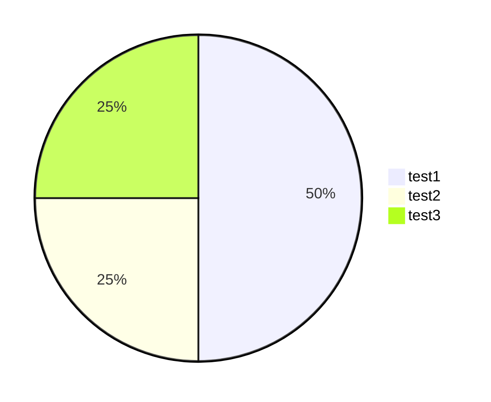

```mapview
{"name":"Default","mapZoom":8,"centerLat":42.3554334,"centerLng":-71.060511,"query":"","chosenMapSource":0}
```


> Le **mayflower** /meɪˈflaʊɚ/ est un vaisseau marchand anglais devenu célèbre pour avoir transporté en 1620 d'Angleterre en Amérique du Nord un groupe de dissidents religieux, les Pilgrim fathers (« Pères pèlerins »), à la recherche d'un lieu pour pratiquer librement leur religion.
>
> À l'origine de ==ce voyage se trouve un groupe de dissidents== anglais de la région de Scrooby (Yorkshire) partis en exil aux Provinces-Unies en 1609 et formant une congrégation dans la ville hollandaise de Leyde : <font color="#ff0000">parmi eux, William Bradford</font>, historiographe du voyage et chef de la colonie de Plymouth (Massachusetts) de 1621 à 1647. 
>
> Les passagers du Mayflower sont considérés comme les pionniers de la colonisation britannique dans cette région du monde, et parfois aussi comme l'origine historique des États-Unis, même si trois autres régions de ce pays, Floride, Virginie et New-York, avaient connu avant des colonisations européennes venant s'ajouter à la population amérindienne.
>
> [Wikipedia](https://fr.wikipedia.org/wiki/Mayflower)





 