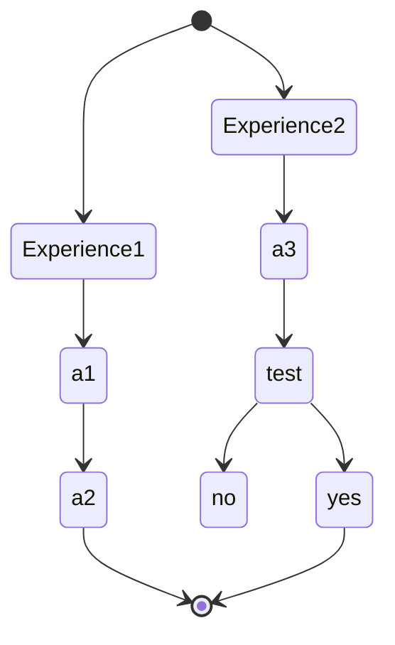
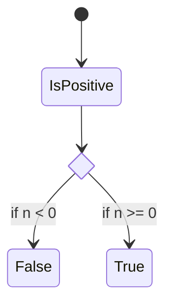

<%*
let qcFileName = await tp.system.prompt("Titre Fiche (ex: Mahomet)")
let qcDomain = tp.file.folder(false)
titleName = "Fiche_"+ qcDomain + "_" + qcFileName
await tp.file.rename(titleName)
-%>

tags : #fiche  <% "#"+qcDomain %> <% "#"+qcFileName %>

---

title:: <% qcFileName %>
domaine:: <% tp.file.folder(false) %>
author:: EmySushi
status:: inprogress
created:: <% tp.file.creation_date("YYYY-MM-DD HH:mm:ss") %>
updated:: <% tp.file.last_modified_date("YYYY-MM-DD HH:mm:ss") %>

<% tp.file.cursor() %>

---

## Definitions
---

## Idees a retenir
---

---

## Liens

Note :  Noter les liens interessant se rapportant au sujet

- liens1
- liens2

## Outils utiles

-   [Resoomer](https://resoomer.com/fr) : en ligne + extension navigateur, multilingue
-   [SMMRY](https://smmry.com/) : en ligne, anglais
-   [Text Summarizer](http://textsummarization.net/text-summarizer) : en ligne, anglais
-   [Text Compactor](https://www.textcompactor.com/) : en ligne, anglaisstateDiagram-v2
        state if_state <<choice>>
        [*] --> IsPositive
        IsPositive --> if_state
        if_state --> False: if n < 0
        if_state --> True : if n >= 0
stateDiagram-v2
        state if_state <<choice>>
        [*] --> IsPositive
        IsPositive --> if_state
        if_state --> False: if n < 0
        if_state --> True : if n >= 0
